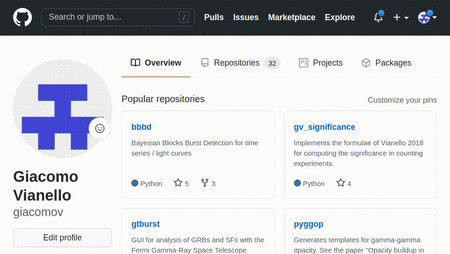
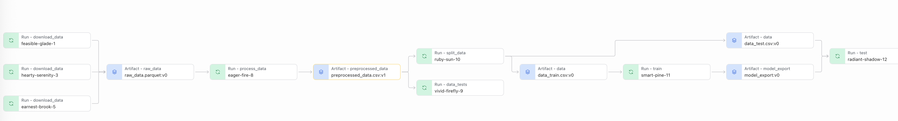

# Introduction 

End-to-End ML Pipeline that produces a trained Random Forest model.

This project is copied from Exercise 14 of "udacity-build-model-workflow-exercises/lesson-5-final-pipeline-release-and-deploy/exercises/exercise_14/solution_dk".

## Run your release
Once you have released in GitHub, you can run your release like this:
```bash
mlflow run [github URL] -v [version] -P ...
```
So for example this is what we run in the video (note that the repository might not be there anymore, this is just an example):
```bash
mlflow run https://github.com/idymko/genre-classification.git \ 
         -v v1.0.0 \
         -P hydra_options="main.project_name=remote_execution"
```

> NOTE: anyone using the pipeline need to be logged in to ``wandb`` (``wandb login``)

# Instructions

In this exercise we are going to bring everything together in a complete ML pipeline that
produces a trained Random Forest model.

# Preliminary step: create a repository and commit and push the starter kit
1. Create a new GitHub repository called ``genre_classification`` in your GitHub account:
   
2. Clone the repository locally:
   ```bash
   git clone [repository_url]
   ```
3. Go into the repository and copy there the starter kit, 
   including all subdirectories:
   ```bash
   cd genre_classification
   cp -r [path to the starter]/starter/* .
   ```
4. Add the files of the starter kit to be tracked:
   ```bash
   git add .
   ```
5. Commit and push:
   ```bash
   git commit -m "Starter kit" -a
   git push
   ```

# Steps to complete the exercise

The starter kit contains all the steps we have previously completed, only slightly modified to 
work better together. 
Your task is to chain them together by completing the ``main.py`` file. Further instructions 
are contained in the file.

When you are done, commit and push to the repository.

After running the pipeline successfully, go to W&B and tag the exported model as ``prod`` as
we did in Exercise 13.

A few notes and instructions:
* When chaining together the steps, the output artifact of a step should be the input artifact
  of the next one (when applicable). Also use the ``artifact_type`` options so that the final
  visualization of the pipeline highlights the different steps. For example, you can use
  ``raw_data`` for the artifact containing the downloaded data, ``preprocessed_data`` for the
  artifact containing the data after the preprocessing, and so on.
  
* For testing, set the ``project_name`` to ``exercise_14``. Once you are done
  developing, do a production run by changing the ``project_name`` to 
  ``genre_classification_prod``. This way the visualization of the pipeline will not contain 
  all your trials and errors. Remember to tag the produced model export as ``prod`` (we are going
  to use it in the next exercise)
  
* When developing, you can override the parameter ``main.execute_steps`` to only execute one or
  more steps of the pipeline, instead of the entire pipeline. This is useful for debugging. 
  For example, this only executes the ``random_forest`` step:
  ```bash
  mlflow run . -P hydra_options="main.execute_steps='random_forest'"
  ```
  and this executes ``download`` and ``preprocess``:
  ```bash
  mlflow run . -P hydra_options="main.execute_steps='download,preprocess'"
  ```

# Resulting pipeline

The following steps are contained in the pipeline: 
- ``download``: download data from url and produce an artifact ``raw_data.parquet``
- ``preprocess``: clean the data and store them into artifact: ``preprocessed_data.csv``
- ``check_data``: validating the input data
- ``segregate``: splitting data into test and train: ``data_train.csv`` and ``data_test.csv``
- ``random_forest``: running the model and storing to ``model_export`` directory
- ``evaluate``: testing the model

Each step can be run separetely or in groups, e.g.:
- ``mlflow run . -P hydra_options="main.execute_steps='download,preprocess'"``
- ``mlflow run . -P hydra_options="main.execute_steps='preprocess,check_data'"``
- ``mlflow run . -P hydra_options="main.execute_steps='segregate'"``
- ``mlflow run . -P hydra_options="main.execute_steps='random_forest'"``
- ``mlflow run . -P hydra_options="main.execute_steps='evaluate'"``

Data and model artifacts are stored in weight and biases:
https://wandb.ai/dkysylychyn-udacity/genre_classification_prod/overview

The following diagram contains the whole pipeline (screenshot from weight and biases:
  

## Final run

- ``mlflow run . -P hydra_options="main.project_name='genre_classification_prod'"``
